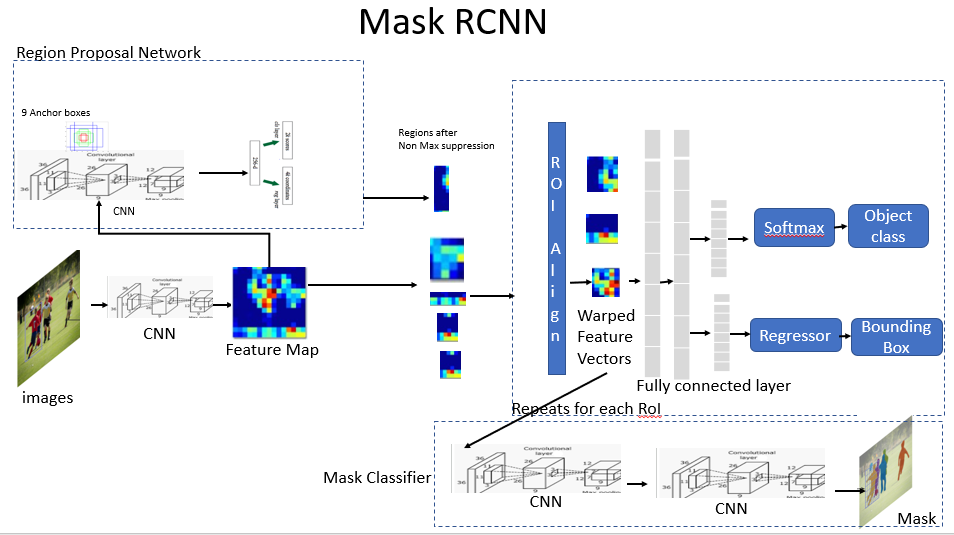
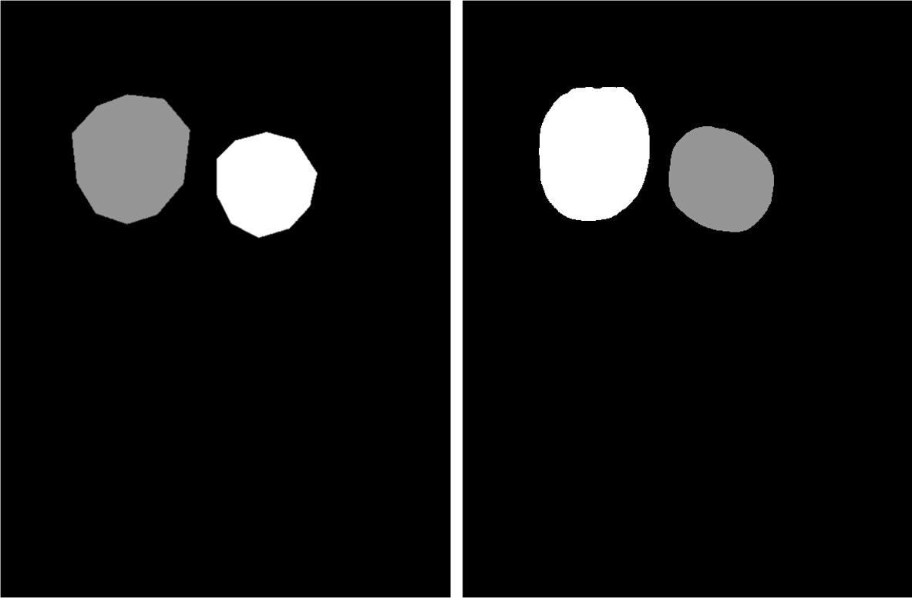

# Mask R-CNN for Object Detection and Segmentation

This is an implementation of [**Mask R-CNN**](https://arxiv.org/abs/1703.06870) on Python 3, Keras, and TensorFlow based on Matterport's [**version**](https://github.com/matterport/Mask_RCNN). The model generates bounding boxes and segmentation masks for each instance of an object in the image, usingFeature Pyramid Network (FPN) and a ResNet101 backbone.



## Features:

* Mask R-CNN implementation built on TensorFlow and Keras.
* Model training with data augmentation and various configuration.
* mAP callback during the training process for initial evaluation.
* Training with 5-fold cross-validation strategy.
* Evaluation with mean Average Precision (mAP) on COCO metric `AP@.50:.05:.95` and PASCAL VOC metric `AP@.50`. For more information, read [**here**](https://cocodataset.org/#detection-eval).
* Jupyter notebooks to visualize the detection pipeline at every step.
* Convert predicted image results to the annotated file respectively for further training or expanding the dataset (with VGG Image Annotator format - the annotatin format is described in detail below). Achieved a finer mask with less annotating time than by handwork (saving ~3 quarters in large-scale).
    * For instance, the annotated mask by handwork (left) and by Mask R-CNN's prediction (right)
        

## Structure:
It is recommended to organize the dataset folder, testing image/video folder and model weight under same folder as the below structure:

    ├── notebooks                                 # several notebooks from Matterport's Mask R-CNN
    ├── dataset                                   # place the dataset here
    │   └── <dataset_name>              
    │       ├── train
    │       │   ├── <image_file 1>                # accept .jpg or .jpeg file
    │       │   ├── <image_file 2>
    │       │   ├── ...
    │       │   └── via_export_json.json          # corresponded single annotation file, must be named like this
    │       ├── val
    │       └── test         
    ├── logs                                      # log folder
    ├── mrcnn                                     # model folder
    ├── test                                      # test folder
    │   ├── image
    │   └── video
    ├── trained_weight                            # pre-trained model and trained weight folder
    |   ...
    ├── environment.yml                           # environment setup file
    ├── README.md
    ├── dataset.py                                # dataset configuration
    ├── evaluation.py                             # weight evaluation
    └── training.py                               # training model
    
## Usage:

 * Conda environment setup:
    ```bash
        conda env create -f environment.yml
        conda activate mask-rcnn
    ```
 * Training:
    ```bash
    * Train a new model starting from pre-trained weights
        python3 training.py --dataset=/path/to/dataset --weight=/path/to/pretrained/weight.h5
    
    * Resume training a model
        python3 training.py --dataset=/path/to/dataset --continue_train=/path/to/latest/weights.h5
    ```
 * Evaluating:
    ```bash
    python3 evaluation.py --dataset=/path/to/dataset --weights=/path/to/pretrained/weight.h5
    ```
 * Testing
    ```bash
    * Image
        python3 image_detection.py --dataset=/path/to/dataset --weights=/path/to/pretrained/weight.h5 --image=/path/to/image/directory

    * Video (update weight path and dataset path in mrcnn.visualize_cv2)
        python3 video_detection.py --video_path = /path/to/testing/video/dir/

    ```
 * Annotation generating:
    ```bash
    python3 annotating_generation.py --dataset=/path/to/dataset --weights=/path/to/pretrained/weight.h5 --image=/path/to/image/directory
    
    ```
 * View training plot:
    ```bash
    tensorboard --logdir=logs/path/to/trained/dir
    
    ```
     
## Annotation format: 

Annotated image for this implementation is created by [VGG Image Annotator](https://www.robots.ox.ac.uk/~vgg/software/via/) with format structure:
```
{ 'filename': '<image_name>.jpg',
           'regions': {
               '0': {
                   'region_attributes': {},
                   'shape_attributes': {
                       'all_points_x': [...],
                       'all_points_y': [...],
                       'name': 'polygon'}},
               ... more regions ...
           },
           'size': <image_size>
}
```

## Notes:

* This implementation is well worked under TensorFlow 1.14.0, Keras 2.2.5, Cuda 10.0.130 and CuDNN 7.6.5
* ```dataset.py``` must be modify for other custom dataset.
* Futher training parameters configuration can be read in [**here**](https://github.com/matterport/Mask_RCNN/wiki).
* Pre-trained weight on COCO: download [**here**](https://github.com/matterport/Mask_RCNN/releases/download/v2.0/mask_rcnn_coco.h5) and place it in ```trained_weight\```
